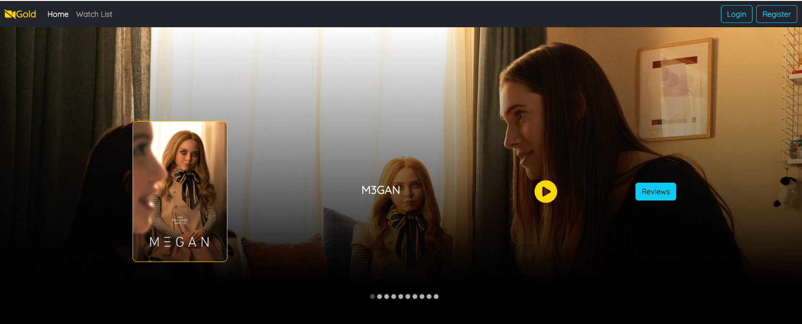

# CineCritique

## Overview
This full-stack movie review application allows users to browse trailers and  review various films, offering an interactive platform for movie enthusiasts. Built using Spring Boot, MongoDB, and React, it combines efficient backend processing with a dynamic and user-friendly frontend.

## Features
- **Movie Browsing**: Users can explore a wide range of movies trailers.
- **User Reviews**: Functionality for users to write and read reviews on movies.
- **Dynamic Data Retrieval**: Backend efficiently handles dynamic data requests and updates.

## Technologies Used
- **Backend**: Spring Boot, MongoDB
- **Frontend**: React
- **Other Tools**: [List any other tools or libraries used]

## Home Page

## Trailer

## Review
